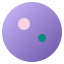

# Wonderful Color · 莫奈配色

基于 Google 官方 [material-color-utilities](https://github.com/material-foundation/material-color-utilities) 的 Material You 动态配色(Monet)主题生成器。

输入一个源色(自定义取色或预设色),实时生成完整的深色 / 浅色 Material 3 配色方案,整站换肤,一键复制 CSS 变量或 JSON 令牌。



## 功能

- **官方算法**:直接使用 material-color-utilities 的 TypeScript 源码(完整内置于 `vendor/mcu/`,站点可离线运行,无需构建、无第三方依赖)
- **7 种方案类型**:Tonal Spot(默认)、Vibrant、Expressive、Neutral、Fidelity、Content、Monochrome
- **深 / 浅双主题**:一键切换,支持跟随系统
- **完整角色色板**:primary / secondary / tertiary / error / surface 等 27 个 M3 角色
- **色调板视图**:6 个调色板的 0–100 色阶,标注官方关键色
- **组件预览**:用常见 Material 组件直观对比深浅色效果
- **导出**:CSS 变量(`--m3-*`)与 JSON 令牌,点击任意色块复制 Hex
- **多语言**:目前支持中文 / English(在 `i18n.js` 中新增字典即可扩展)
- 所有状态(源色、方案、主题、语言)本地记忆

## 目录结构

```
├── index.html        # 页面结构(data-i18n 绑定静态文案)
├── styles.css        # 样式,颜色全部来自 --m3-* 变量
├── js/
│   ├── main.js       # 入口:事件绑定与整页重渲染编排
│   ├── state.js      # 全局状态与 localStorage / sessionStorage 持久化
│   ├── engine.js     # 配色引擎封装与静态配置(角色、色阶、预设色)
│   ├── render.js     # 各区块的 HTML 渲染
│   ├── exporter.js   # CSS 变量 / JSON 令牌导出
│   ├── lang.js       # t() 文案取值与参数插值
│   └── i18n.js       # 多语言文案(新增语言在此扩展)
├── favicon.svg       # 图标
├── .nojekyll         # 跳过 Jekyll 处理
└── vendor/mcu/       # Google material-color-utilities 源码(Apache-2.0)
```

## 使用导出的配色

复制出的 CSS 变量可直接粘贴到你的项目:

```css
:root, [data-theme="light"] {
  --m3-primary: #65558f;
  --m3-on-primary: #ffffff;
  /* ... */
}
[data-theme="dark"] {
  --m3-primary: #cfbdfe;
  /* ... */
}
```

## 致谢

- [material-foundation/material-color-utilities](https://github.com/material-foundation/material-color-utilities) — Apache-2.0,完整源码与许可证见 `vendor/mcu/`
